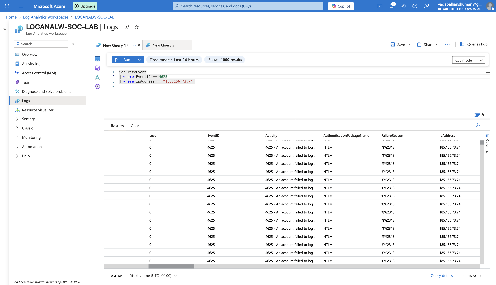
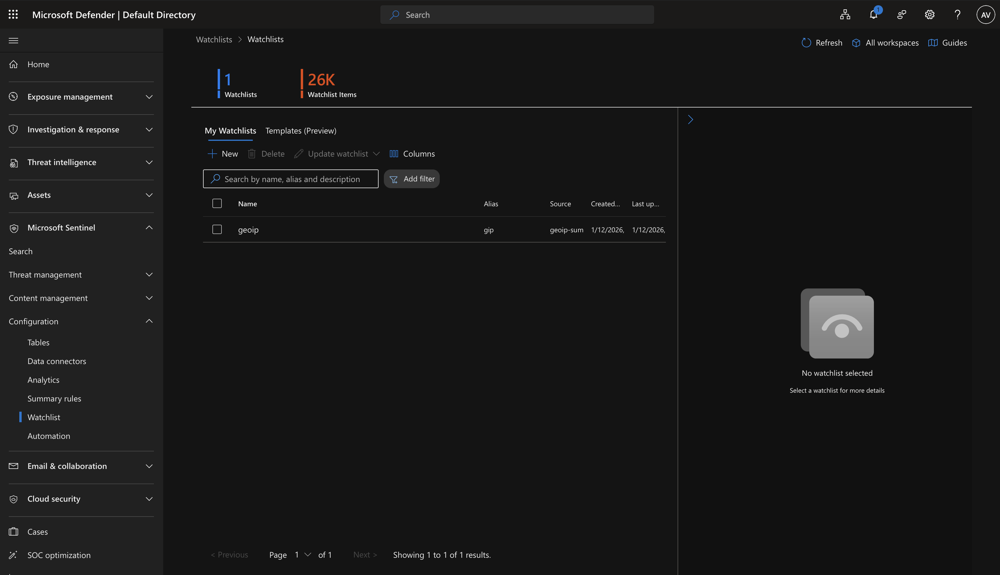
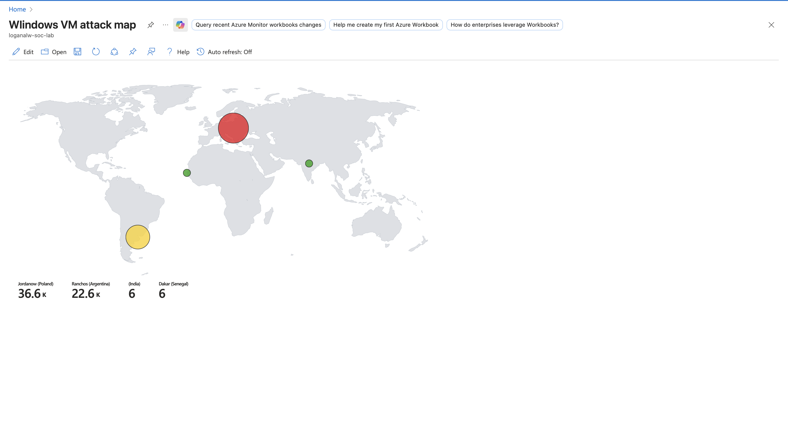

# Azure Sentinel Threat Hunting Lab

## 🎯 Executive Summary

This lab simulates a brute-force attack targeting a Windows virtual machine. Using Microsoft Sentinel and Log Analytics, repeated failed authentication attempts were detected, enriched with GeoIP intelligence via a custom watchlist, and visualized geographically to identify high-volume attack sources. 
The investigation demonstrates practical threat hunting methodology, KQL-based detection engineering, IOC enrichment, and structured MITRE ATT&CK mapping aligned to real-world SOC operations.

---

## 📖 Project Overview

This lab simulates a real-world brute-force attack investigation using Microsoft Sentinel and Log Analytics.

The objective was to:

- Detect repeated failed authentication attempts (Event ID 4625)
- Identify suspicious source IP addresses
- Enrich IP data using a custom GeoIP watchlist
- Visualize attacker distribution geographically
- Map findings to MITRE ATT&CK techniques

---

## 🏗️ Lab Architecture

`Windows VM → SecurityEvent Logs → Log Analytics Workspace → Microsoft Sentinel → Watchlist Enrichment → Attack Map Visualization`

---

## 🔍 Detection: Brute-Force Authentication Failures



Repeated failed logon attempts were identified using:

```kql
SecurityEvent
| where EventID == 4625
| where IpAddress == "185.156.73.74"
```

This allowed isolation of suspicious external authentication attempts targeting the VM.

Evidence:

🌍 Threat Intelligence Enrichment



A custom GeoIP watchlist containing 26,000+ IP mappings was imported into Sentinel.
The following enrichment logic was applied:

```kql
let GeoIPDB_FULL = _GetWatchlist("gip");
let WindowsEvents = SecurityEvent;
WindowsEvents
| where EventID == 4625
| evaluate ipv4_lookup(GeoIPDB_FULL, IpAddress, network)
```
This enabled geographic correlation of attacker IPs.


## Watchlist Configuration
A custom GeoIP watchlist containing 26,000+ IP-to-location mappings was imported into Microsoft Sentinel.  
The watchlist was used to enrich authentication logs with geographic metadata for attack correlation.


## Enrichment Logic
KQL-based enrichment was applied using the `_GetWatchlist()` function and `ipv4_lookup()` operator to correlate attacker IP addresses with geographic data.


## 📊 Log Analysis & Field Projection

Key fields extracted:

Timestamp
Account
Computer
Event ID
Source IP

```kql
SecurityEvent
| where EventID == 4625
| project TimeGenerated, Account, Computer, EventID, Activity, IpAddress
```
Log Evidence
Extracted authentication telemetry including timestamp, account, computer name, Event ID, and source IP address for structured investigation.


🗺️ Attack Visualization



Using Sentinel Workbooks, attacker IPs were plotted geographically.

This provided:
- Geographic threat concentration
- High-volume attack source identification
- Executive-level visualization of attack patterns
- Final Attack Map

## 🛡 Incident Response Recommendations

Based on the investigation findings:

- Implement account lockout policies to mitigate brute-force attempts.
- Enable conditional access and MFA for privileged accounts.
- Monitor high-volume authentication failures using analytic rules.
- Automate IP reputation checks using Sentinel playbooks.
- Block confirmed malicious IP addresses at firewall perimeter.

These measures reduce exposure to credential-based attacks and strengthen identity protection controls.


🎯 MITRE ATT&CK Mapping

The observed activity aligns with the following MITRE ATT&CK techniques:

- **T1110 – Brute Force**  
  Repeated authentication failures targeting valid accounts.
- **T1078 – Valid Accounts (Attempted Abuse)**  
  Attempts to compromise legitimate user credentials.
- **T1046 – Network Service Scanning (Possible Precursor Activity)**  
  Potential reconnaissance preceding authentication attempts.

🛡️ Key Skills Demonstrated
- KQL-based detection engineering
- Windows Security Event log analysis
- Threat hunting methodology
- IOC enrichment via Sentinel Watchlists
- GeoIP-based attack visualization
- MITRE ATT&CK technique mapping
- Security documentation & reporting


🚀 Future Improvements

- Automate enrichment via playbooks
- Implement threshold-based analytic rules
- Correlate with Azure AD Sign-in logs
- Build anomaly-based detection model

👤 Author

Ansuman Vadapalli
Security Operations | Threat Detection | Incident Investigation
CompTIA Security+
